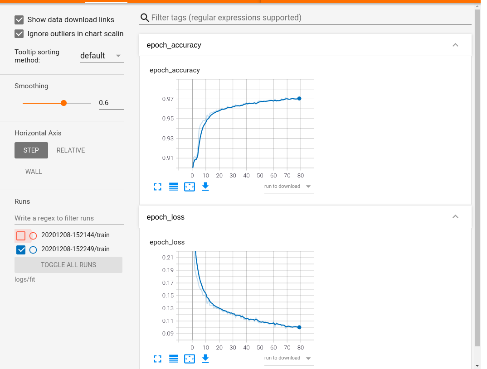
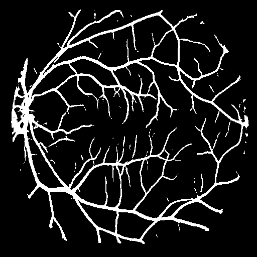

# U-net_using_TF2
This example demonstrates the use of U-net model for retinal blood vessel segmentation on tensorflow 2.x

# This jupyter notebook presents all requirements needed to achieve pixel-level semantic segmentation using images. This specific use case is on retinal image blood vessel segmentation as explained in the blog series:
https://www.youtube.com/watch?v=1kiPy2tvECs&list=PLQKflBw-kPeecjC345saTF2YrfImciCrr

## This specific implementation models the U-net implemenation in the research paper: Roychowdhury S. Few Shot Learning Framework to Reduce Inter-observer Variability in Medical Images. IEEE ICPR, 2021. https://arxiv.org/abs/2008.02952  

# Step 1: Library requirements
Download the library requirements "requirements.yml" and ensure your python environment is compatible.

# Step 2: Train and Test Data
Download the STARE vessel data 
* From the page https://cecas.clemson.edu/~ahoover/stare/probing/index.html
* Download 20 images (top row) followed by the labelled vessels by Adam Hoover (second row). 
* Unpack the images and labels in a local folder.
* Create the following folder structure in your local folder:
    ./STARE/
      --train
          --images
          --GT
      --test
          --images
          --GT
 * The following images are used to train: [image0001	image0002	image0003	image0004	image0005	image0044	image0077	image0081	image0082	image0139 ]
* Place these images under ./STARE/train/images/ folder and the hand labelled images under ./STARE/train/GT folder
* All remaining images are placed under ./STARE/test/images/ and the respective hand labelled images are under ./STARE/test/GT/
 
 # Step 3: Get the code
 Download the U-net_TF2_retinal_image_segmentation_STARE.ipynb and run it.
 
 # Step 4: Results:
 * The U-net with Depth 4 is trained using 10 images, loss function of binary-crossentropy, Adam optimizer and augmented significnatly using the keras imagedata generator.
 * The tensorboard graphs are as follows:
 
 
 * The segmentation perfromances on test images are: 
 Precision= 0.7557, Recall= 0.8493 IoU= 0.6648 acc= 0.9606 F1= 0.7979
 
 * Sample examples are:
 Predicted output:  
 
 * Groundtruth: 

          
          
      

